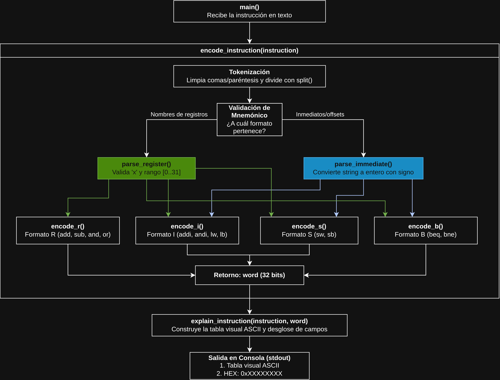

# Documentación Técnica:
# Codificador Educativo de Instrucciones RISC-V (RV32I)

**Instituto Tecnológico de Costa Rica (TEC)**  
**Curso:** CE-4301 Arquitectura de Computadores I  
**Profesor** Jeferson Gonzalez Gomez  
**Semestre:** 2026-II

**Estudiante** Saddy Guzmán Rojas  
**Carné** 2023088184 

---

## 1. Arquitectura del Código y Decisiones de Diseño

El codificador fue diseñado utilizando unicamente la biblioteca estandar de python,siguiendo la idea de como funciona un compilador real. Su proposito principal es procesar una unica instruccion en lenguaje ensamblador, verificar la validez lexica y semantica, traducir a su representacion binaria de 32 bits y al final mostrar una tabla de informacion sobre la instruccion.

### 1.1. Diagrama de Arquitectura y Flujo de Datos

El flujo de procesamiento e interacción de componentes en [`encoder.py`](encoder.py) se modela en el siguiente diagrama de arquitectura:




### 1.2. Decisiones de Diseño Clave

1. **Parser Simple:**
   - La sintaxis de las 12 instrucciones RV32I del subconjunto se divide en dos estructuras: registros separados por comas (`add rd, rs1, rs2`, `addi rd, rs1, imm`, `beq rs1, rs2, imm`) o accesos a memoria (`lw rd, imm(rs1)`, `sw rs2, imm(rs1)`).
   - Al sustituir comas y paréntesis por espacios antes de invocar `.split()`, la instrucción se divide de forma limpia en una lista ordenada de tokens.

2. **Validación de Registros (`parse_register`):**
   - Se asegura de que empiece con `'x'` y que el número esté entre `0` y `31` (de `x0` a `x31`). Al usar `int(reg[1:])` convierte solo números en base 10 estándar y descarta cualquier formato no válido.

3. **Flexibilidad en Inmediatos (`parse_immediate`):**
   - Se utiliza `int(imm.strip(), 0)`. El valor `base=0` permite a Python inferir la base numérica, admitiendo valores positivos y negativos en decimal (ej. `100`, `-50`), hexadecimal (ej. `0x1F`) o binario (ej. `0b1010`), tal como lo soportaria un ensamblador estándar.

4. **Manejo de Complemento a Dos y Bits Infinitos en Python:**
   - En Python, los números enteros tienen precisión arbitraria. Un número negativo en Python posee una extensión infinita de unos (`1`) hacia la izquierda.
   - Para obtener un inmediato con signo en los bits requeridos para el formato (12 bits para Tipo I y S, o 13 bits para Tipo B), se aplica una operación `AND` con una máscara de bits (`imm & 0xFFF` o `imm & 0x1FFF`).
   - Los ceros de la máscara vuelven cero todos los bits a la izquierda, dejando al binario en complemento a 2 listo para ser desplazado sin desbordar los campos vecinos.

5. **Acomodo del Salto en Formato B (Bits repartidos):**
   - **El bit 0 no se guarda:** Como en RISC-V las instrucciones siempre están en direcciones pares, cualquier salto es un número par (termina en 0). Por eso el procesador asume que `imm[0] = 0` y no gasta espacio guardándolo. Con esto se logra representar saltos de 13 bits usando solo 12 bits en la instrucción.
   - **Los bits vienen desordenados**: Para facilitar el trabajo que tiene que hacer el procesador físico:
     - El bit de signo (`imm[12]`) se coloca obligatoriamente en el bit 31, igual que en todos los demás formatos de RISC-V.
     - Los registros `rs1` y `rs2` se quedan fijos en el centro de la instrucción.
   - **Lo que hace el programa:** Como el valor del salto queda dividido debido a la distribución de los registros, el programa extrae el número en 4 partes (`imm[12]`, `imm[10:5]`, `imm[4:1]` e `imm[11]`) usando desplazamientos (`>>`) y máscaras (`&`), y luego coloca cada parte en su posición final con `<<` y `|`.

---

## 2. Especificación de Módulos y Funciones Principales (API)

A continuación se documentan formalmente las funciones que integran el módulo central [`encoder.py`](encoder.py):

### 2.1. Funciones de Parseo y Validación Léxica

#### `parse_register(reg: str) -> int`
* **Propósito:** Recibe una cadena de texto que representa un registro (por ejemplo, `"x5"` o `"  X14 "`) y retorna el numero entero correspondiente en base 10.
* **Parámetros:**
  - `reg` (`str`): Cadena con el nombre del registro.
* **Retorno:**
  - `int`: Número entero en el rango $[0, 31]$.
* **Lógica de validación:**
  1. Aplica `.strip().lower()` para limpiar espacios y dejarlo en minúscula.
  2. Revisa que empiece con `'x'`.
  3. Convierte el número después de la 'x' a entero con `int(reg[1:])`.
  4. Valida que el número de registro esté entre `0` y `31`. Si no cumple, da error.

#### `parse_immediate(imm: str) -> int`
* **Propósito:** Convierte el string inmediato o desplazamiento en un número entero con signo.
* **Parámetros:**
  - `imm` (`str`): Cadena con el valor numérico (ej. `"100"`, `"-50"`, `"0x1F"`, `"0b1010"`).
* **Retorno:**
  - `int`: Entero con signo representativo del valor matemático.
* **Lógica de validación:**
  - Utiliza `int(imm.strip(), 0)`. El argumento `base=0` le permite a Python detectar automáticamente si el número viene en decimal, hexadecimal (`0x`) o binario (`0b`), aceptando tanto valores positivos como negativos.

---

### 2.2. Funciones de Codificación a Nivel de Bits

#### `encode_r(funct7: int, rs2: int, rs1: int, funct3: int, rd: int, opcode: int) -> int`
* **Propósito:** Ensambla los campos de una instrucción Tipo R en una palabra de 32 bits.
* **Operación de bits:**
  $$\text{word} = (\text{funct7} \ll 25) \mid (\text{rs2} \ll 20) \mid (\text{rs1} \ll 15) \mid (\text{funct3} \ll 12) \mid (\text{rd} \ll 7) \mid \text{opcode}$$

#### `encode_i(imm: int, rs1: int, funct3: int, rd: int, opcode: int) -> int`
* **Propósito:** Ensambla una instrucción Tipo I (aritmética con inmediato o carga de memoria).
* **Operación de bits:**
  - Aplica la máscara `imm_12 = imm & 0xFFF` para recortar el inmediato a exactamente 12 bits en complemento a dos.
  - Desplaza el inmediato 20 posiciones hacia la izquierda y combina los operandos:
  $$\text{word} = (\text{imm\_12} \ll 20) \mid (\text{rs1} \ll 15) \mid (\text{funct3} \ll 12) \mid (\text{rd} \ll 7) \mid \text{opcode}$$

#### `encode_s(imm: int, rs2: int, rs1: int, funct3: int, opcode: int) -> int`
* **Propósito:** Ensambla una instrucción Tipo S de almacenamiento en memoria RAM.
* **Operación de bits:**
  - Recorta a 12 bits: `imm_12 = imm & 0xFFF`.
  - Extrae los 5 bits inferiores: `imm_4_0 = imm_12 & 0x1F`.
  - Extrae los 7 bits superiores: `imm_11_5 = (imm_12 >> 5) & 0x7F`.
  - Ubica `imm_11_5` en los bits $[31:25]$ e `imm_4_0` en los bits $[11:7]$:
  $$\text{word} = (\text{imm\_11\_5} \ll 25) \mid (\text{rs2} \ll 20) \mid (\text{rs1} \ll 15) \mid (\text{funct3} \ll 12) \mid (\text{imm\_4\_0} \ll 7) \mid \text{opcode}$$

#### `encode_b(imm: int, rs2: int, rs1: int, funct3: int, opcode: int) -> int`
* **Propósito:** Ensambla una instrucción de salto condicional Tipo B.
* **Operación de bits:**
  - Recorta el desplazamiento a 13 bits con signo: `imm_13 = imm & 0x1FFF`.
  - Descompone el inmediato en 4 secciones sin almacenar el bit 0:
    - `imm_12 = (imm_13 >> 12) & 0x1` (bit 12, signo).
    - `imm_11 = (imm_13 >> 11) & 0x1` (bit 11).
    - `imm_10_5 = (imm_13 >> 5) & 0x3F` (bits 10 al 5, 6 bits).
    - `imm_4_1 = (imm_13 >> 1) & 0xF` (bits 4 al 1, 4 bits).
  - Posiciona cada sección en las coordenadas exactas de la arquitectura RV32I:
  $$\text{word} = (\text{imm\_12} \ll 31) \mid (\text{imm\_10\_5} \ll 25) \mid (\text{rs2} \ll 20) \mid (\text{rs1} \ll 15) \mid (\text{funct3} \ll 12) \mid (\text{imm\_4\_1} \ll 8) \mid (\text{imm\_11} \ll 7) \mid \text{opcode}$$

---

### 2.3. Funciones Principales

#### `encode_instruction(instruction: str) -> int`
* **Propósito:** Es la función principal del programa. Recibe la instrucción en texto, la limpia y separa en partes, revisa cuál mnemónico es y llama a la función correspondiente (`encode_r`, `encode_i`, `encode_s` o `encode_b`) para armar el código máquina.
* **Retorno:** El número entero de 32 bits que representa la instrucción en binario/hexadecimal.

#### `explain_instruction(instruction: str, word: int) -> str`
* **Propósito:** Genera el texto con la tabla visual en ASCII. Muestra la instrucción dividida en sus campos con sus respectivos bits, valores en binario/decimal y una explicación sencilla de lo que hace cada parte.

---

## 3. Instrucciones Soportadas y Fuentes Consultadas

El codificador soporta 12 instrucciones:

| Mnemónico | Formato | Categoría | Opcode (7b) | funct3 (3b) | funct7 (7b) |
| :--- | :---: | :--- | :---: | :---: | :---: |
| **`add`** | **R** | Aritmética registro-registro | `0110011` (`0x33`) | `000` (`0x0`) | `0000000` (`0x00`) |
| **`sub`** | **R** | Aritmética registro-registro | `0110011` (`0x33`) | `000` (`0x0`) | `0100000` (`0x20`) |
| **`and`** | **R** | Lógica registro-registro | `0110011` (`0x33`) | `111` (`0x7`) | `0000000` (`0x00`) |
| **`or`** | **R** | Lógica registro-registro | `0110011` (`0x33`) | `110` (`0x6`) | `0000000` (`0x00`) |
| **`addi`** | **I** | Aritmética con inmediato | `0010011` (`0x13`) | `000` (`0x0`) | N/A |
| **`andi`** | **I** | Lógica con inmediato | `0010011` (`0x13`) | `111` (`0x7`) | N/A |
| **`lw`** | **I** | Carga desde memoria (Word) | `0000011` (`0x03`) | `010` (`0x2`) | N/A |
| **`lb`** | **I** | Carga desde memoria (Byte) | `0000011` (`0x03`) | `000` (`0x0`) | N/A |
| **`sw`** | **S** | Almacenamiento en memoria (Word) | `0100011` (`0x23`) | `010` (`0x2`) | N/A |
| **`sb`** | **S** | Almacenamiento en memoria (Byte) | `0100011` (`0x23`) | `000` (`0x0`) | N/A |
| **`beq`** | **B** | Salto si igual (*Branch Equal*) | `1100011` (`0x63`) | `000` (`0x0`) | N/A |
| **`bne`** | **B** | Salto si distinto (*Branch Not Equal*) | `1100011` (`0x63`) | `001` (`0x1`) | N/A |

### Fuentes consultadas:
1. **Manual Oficial de la ISA RISC-V:**  
   Andrew Waterman and Krste Asanović. *The RISC-V Instruction Set Manual, Volume I: User-Level ISA, Document Version 20191213*. RISC-V Foundation, 2019.  
   - Capítulo 2: RV32I Base Integer Instruction Set.
   - Capítulo 24: Instruction Set Listings.
2. **Referencia Visual Interactiva:**  
   *RISC-V Instruction Set Interactive Reference* (https://msyksphinz-self.github.io/riscv-isadoc/html/rvi.html).

---

## 4. Ejemplos de Salida Explicativa por Formato

La función `explain_instruction` genera para cada instrucción una tabla visual en ASCII con rangos de bits, valores en múltiples bases y una descripción del rol de cada campo:

### A. Formato Tipo R (`add x7, x20, x6`)
```text
================================================================================
Instrucción : add x7, x20, x6
Formato     : Tipo R (Aritmética registro-registro)
Codificación: 0x006A03B3
Binario (32): 0000000 00110 10100 000 00111 0110011
================================================================================
Desglose de campos:
+-------------+----------+----------+----------+----------+----------+----------+
| Campo       | funct7   | rs2      | rs1      | funct3   | rd       | opcode   |
| Bits        | [31:25]  | [24:20]  | [19:15]  | [14:12]  | [11:7]   | [6:0]    |
| Binario     | 0000000  | 00110    | 10100    | 000      | 00111    | 0110011  |
| Valor       | 0x00     | 6  (x6 ) | 20 (x20) | 0x0      | 7  (x7 ) | 0x33     |
+-------------+----------+----------+----------+----------+----------+----------+
Explicación de campos:
- opcode (0b0110011 / 0x33): Operación aritmética entre registros RV32I.
- rd (x7): Registro destino donde se almacenará el resultado.
- funct3 (0b000): Código de función de 3 bits para la familia ADD.
- rs1 (x20): Primer registro fuente (primer operando).
- rs2 (x6): Segundo registro fuente (segundo operando).
- funct7 (0b0000000): Código de 7 bits que especifica la operación Suma (ADD).
HEX: 0x006a03b3
```

### B. Formato Tipo I Carga (`lw x30, -1049(x14)`)
```text
================================================================================
Instrucción : lw x30, -1049(x14)
Formato     : Tipo I (Carga desde memoria (Load))
Codificación: 0xBE772F03
Binario (32): 101111100111 01110 010 11110 0000011
================================================================================
Desglose de campos:
+-------------+--------------+----------+----------+----------+----------+
| Campo       | imm[11:0]    | rs1      | funct3   | rd       | opcode   |
| Bits        | [31:20]      | [19:15]  | [14:12]  | [11:7]   | [6:0]    |
| Binario     | 101111100111 | 01110    | 010      | 11110    | 0000011  |
| Valor       | -1049        | 14 (x14) | 0x2      | 30 (x30) | 0x03     |
+-------------+--------------+----------+----------+----------+----------+
Explicación de campos:
- opcode (0b0000011 / 0x03): Identifica la categoría Carga desde memoria (Load).
- rd (x30): Registro destino donde se guardará el resultado.
- funct3 (0b010): Función que especifica la instrucción (LW).
- rs1 (x14): Registro base que contiene la dirección de memoria.
- imm[11:0] (-1049): Desplazamiento (offset) con signo sumado a la dirección base.
HEX: 0xbe772f03
```

### C. Formato Tipo S (`sw x31, -411(x23)`)
```text
================================================================================
Instrucción : sw x31, -411(x23)
Formato     : Tipo S (Almacenamiento en memoria)
Codificación: 0xE7FBA2A3
Binario (32): 1110011 11111 10111 010 00101 0100011
================================================================================
Desglose de campos:
+-------------+------------+----------+----------+----------+-----------+----------+
| Campo       | imm[11:5]  | rs2      | rs1      | funct3   | imm[4:0]  | opcode   |
| Bits        | [31:25]    | [24:20]  | [19:15]  | [14:12]  | [11:7]    | [6:0]    |
| Binario     | 1110011    | 11111    | 10111    | 010      | 00101     | 0100011  |
| Valor       | 0b1110011  | 31 (x31) | 23 (x23) | 0x2      | 0b00101   | 0x23     |
+-------------+------------+----------+----------+----------+-----------+----------+
Explicación de campos:
- opcode (0b0100011 / 0x23): Instrucción de almacenamiento en memoria (Store).
- imm (ensamblado): -411 (offset de 12 bits dividido en imm[11:5] e imm[4:0]).
- funct3 (0b010): Identifica la operación SW (Store Word, 32 bits).
- rs1 (x23): Registro base que contiene la dirección base en memoria.
- rs2 (x31): Registro fuente cuyo dato se escribirá en memoria.
HEX: 0xe7fba2a3
```

### D. Formato Tipo B (`beq x30, x4, -80`)
```text
================================================================================
Instrucción : beq x30, x4, -80
Formato     : Tipo B (Salto condicional)
Codificación: 0xFA4F08E3
Binario (32): 1111101 00100 11110 000 10001 1100011
================================================================================
Desglose de campos:
+-------------+---------------+----------+----------+----------+---------------+----------+
| Campo       | imm[12|10:5]  | rs2      | rs1      | funct3   | imm[4:1|11]   | opcode   |
| Bits        | [31:25]       | [24:20]  | [19:15]  | [14:12]  | [11:7]        | [6:0]    |
| Binario     | 1111101       | 00100    | 11110    | 000      | 10001         | 1100011  |
| Valor       | 0b1111101     | 4  (x4 ) | 30 (x30) | 0x0      | 0b10001       | 0x63     |
+-------------+---------------+----------+----------+----------+---------------+----------+
Explicación de campos:
- opcode (0b1100011 / 0x63): Instrucción de salto condicional (Branch).
- imm (ensamblado): -80 bytes (offset relativo al PC de 13 bits con signo, imm[0]=0 implícito).
- funct3 (0b000): Condición de salto BEQ (si rs1 == rs2).
- rs1 (x30): Primer registro a comparar.
- rs2 (x4): Segundo registro a comparar.
HEX: 0xfa4f08e3
```

---

## 5. Evidencia de Validación contra el Toolchain Oficial (36 Casos de Prueba)

Para verificar el cumplimiento funcional contra herramientas oficiales, se construyó una suite de **36 casos de prueba independientes** (3 escenarios por cada una de las 12 instrucciones: *Positivo*, *Negativo/Especial*, y *Límite/Borde*).


Nota: Al compilar instrucciones de salto tipo B con el ensamblador oficial de GNU (`as` / `gcc`), un operando numérico puro puede ser interpretado como dirección absoluta de memoria. Para indicar explícitamente un desplazamiento relativo al PC, se utiliza la notación de ubicación actual `.` (por ejemplo, `beq x1, x2, .+16` o `bne x7, x8, .-16`).

A continuación se detalla la comparación entre la salida del codificador y la obtenida mediante `riscv64-unknown-elf-objdump -d`:

| # | Instrucción | Escenario | Salida Modelo | Salida `objdump` | Coincidencia |
| :-: | :--- | :--- | :-: | :-: | :-: |
| 1 | `add x1, x2, x3` | Estándar (Positivo) | `0x003100b3` | `0x003100b3` |  SÍ |
| 2 | `add x0, x5, x6` | Registro x0 destino | `0x00628033` | `0x00628033` |  SÍ |
| 3 | `add x31, x31, x31` | Registro límite (x31) | `0x01ff8fb3` | `0x01ff8fb3` |  SÍ |
| 4 | `sub x10, x11, x12` | Estándar (Positivo) | `0x40c58533` | `0x40c58533` |  SÍ |
| 5 | `sub x5, x0, x7` | Registro x0 fuente | `0x407002b3` | `0x407002b3` |  SÍ |
| 6 | `sub x31, x30, x0` | Registro límite x31 | `0x400f0fb3` | `0x400f0fb3` |  SÍ |
| 7 | `and x5, x6, x7` | Estándar (Positivo) | `0x007372b3` | `0x007372b3` |  SÍ |
| 8 | `and x8, x0, x9` | Registro x0 fuente | `0x00907433` | `0x00907433` |  SÍ |
| 9 | `and x31, x31, x0` | Registro límite x31 | `0x000fffb3` | `0x000fffb3` |  SÍ |
| 10 | `or x1, x2, x3` | Estándar (Positivo) | `0x003160b3` | `0x003160b3` |  SÍ |
| 11 | `or x4, x5, x0` | Registro x0 fuente | `0x0002e233` | `0x0002e233` |  SÍ |
| 12 | `or x31, x1, x30` | Registro límite x31 | `0x01e0efb3` | `0x01e0efb3` |  SÍ |
| 13 | `addi x1, x2, 100` | Inmediato Positivo | `0x06410093` | `0x06410093` |  SÍ |
| 14 | `addi x5, x6, -50` | Inmediato Negativo | `0xfce30293` | `0xfce30293` |  SÍ |
| 15 | `addi x31, x0, 2047` | Límite Máximo Inmediato (+2047) | `0x7ff00f93` | `0x7ff00f93` |  SÍ |
| 16 | `andi x10, x11, 255` | Inmediato Positivo | `0x0ff5f513` | `0x0ff5f513` |  SÍ |
| 17 | `andi x12, x13, -1` | Inmediato Negativo (-1) | `0xfff6f613` | `0xfff6f613` |  SÍ |
| 18 | `andi x31, x0, -2048` | Límite Mínimo Inmediato (-2048) | `0x80007f93` | `0x80007f93` |  SÍ |
| 19 | `lw x5, 16(x6)` | Offset Positivo | `0x01032283` | `0x01032283` |  SÍ |
| 20 | `lw x7, -32(x8)` | Offset Negativo | `0xfe042383` | `0xfe042383` |  SÍ |
| 21 | `lw x31, 2047(x0)` | Límite Máximo Offset (+2047) | `0x7ff02f83` | `0x7ff02f83` |  SÍ |
| 22 | `lb x1, 4(x2)` | Offset Positivo | `0x00410083` | `0x00410083` |  SÍ |
| 23 | `lb x3, -8(x4)` | Offset Negativo | `0xff820183` | `0xff820183` |  SÍ |
| 24 | `lb x0, 0(x0)` | Offset Cero / Base x0 | `0x00000003` | `0x00000003` |  SÍ |
| 25 | `sw x5, 12(x6)` | Offset Positivo | `0x00532623` | `0x00532623` |  SÍ |
| 26 | `sw x7, -24(x8)` | Offset Negativo | `0xfe742423` | `0xfe742423` |  SÍ |
| 27 | `sw x31, -2048(x0)` | Límite Mínimo Offset (-2048) | `0x81f02023` | `0x81f02023` |  SÍ |
| 28 | `sb x1, 2(x2)` | Offset Positivo | `0x00110123` | `0x00110123` |  SÍ |
| 29 | `sb x3, -10(x4)` | Offset Negativo | `0xfe320b23` | `0xfe320b23` |  SÍ |
| 30 | `sb x0, 0(x31)` | Offset Cero / Registro x31 | `0x000f8023` | `0x000f8023` |  SÍ |
| 31 | `beq x1, x2, 16` | Salto Positivo (+16 bytes) | `0x00208863` | `0x00208863` |  SÍ |
| 32 | `beq x3, x4, -32` | Salto Negativo (-32 bytes) | `0xfe4180e3` | `0xfe4180e3` |  SÍ |
| 33 | `beq x0, x0, 0` | Salto Cero / Registro x0 | `0x00000063` | `0x00000063` |  SÍ |
| 34 | `bne x5, x6, 8` | Salto Positivo (+8 bytes) | `0x00629463` | `0x00629463` |  SÍ |
| 35 | `bne x7, x8, -16` | Salto Negativo (-16 bytes) | `0xfe8398e3` | `0xfe8398e3` |  SÍ |
| 36 | `bne x31, x0, -4096` | Límite Mínimo Salto (-4096 bytes) | `0x800f9063` | `0x800f9063` |  SÍ |

### Log de desensamblado (`riscv64-elf-objdump -d pruebas_36.o`):

A continuación se presenta la captura de la salida obtenida por el desensamblador oficial de GNU para los 36 casos compilados desde `pruebas_36.s`:

```text
Disassembly of section .text:

00000000 <_start>:
   0:	003100b3          	add	ra,sp,gp
   4:	00628033          	add	zero,t0,t1
   8:	01ff8fb3          	add	t6,t6,t6
   c:	40c58533          	sub	a0,a1,a2
  10:	407002b3          	neg	t0,t2
  14:	400f0fb3          	sub	t6,t5,zero
  18:	007372b3          	and	t0,t1,t2
  1c:	00907433          	and	s0,zero,s1
  20:	000fffb3          	and	t6,t6,zero
  24:	003160b3          	or	ra,sp,gp
  28:	0002e233          	or	tp,t0,zero
  2c:	01e0efb3          	or	t6,ra,t5
  30:	06410093          	addi	ra,sp,100
  34:	fce30293          	addi	t0,t1,-50
  38:	7ff00f93          	li	t6,2047
  3c:	0ff5f513          	zext.b	a0,a1
  40:	fff6f613          	andi	a2,a3,-1
  44:	80007f93          	andi	t6,zero,-2048
  48:	01032283          	lw	t0,16(t1)
  4c:	fe042383          	lw	t2,-32(s0)
  50:	7ff02f83          	lw	t6,2047(zero) # 7ff <_start+0x7ff>
  54:	00410083          	lb	ra,4(sp)
  58:	ff820183          	lb	gp,-8(tp) # fffffff8 <_start+0xfffffff8>
  5c:	00000003          	lb	zero,0(zero) # 0 <_start>
  60:	00532623          	sw	t0,12(t1)
  64:	fe742423          	sw	t2,-24(s0)
  68:	81f02023          	sw	t6,-2048(zero) # fffff800 <_start+0xfffff800>
  6c:	00110123          	sb	ra,2(sp)
  70:	fe320b23          	sb	gp,-10(tp) # fffffff6 <_start+0xfffffff6>
  74:	000f8023          	sb	zero,0(t6)
  78:	00208863          	beq	ra,sp,88 <_start+0x88>
  7c:	fe4180e3          	beq	gp,tp,5c <_start+0x5c>
  80:	00000063          	beqz	zero,80 <_start+0x80>
  84:	00629463          	bne	t0,t1,8c <_start+0x8c>
  88:	fe8398e3          	bne	t2,s0,78 <_start+0x78>
  8c:	800f9063          	bnez	t6,fffff08c <_start+0xfffff08c>
```
